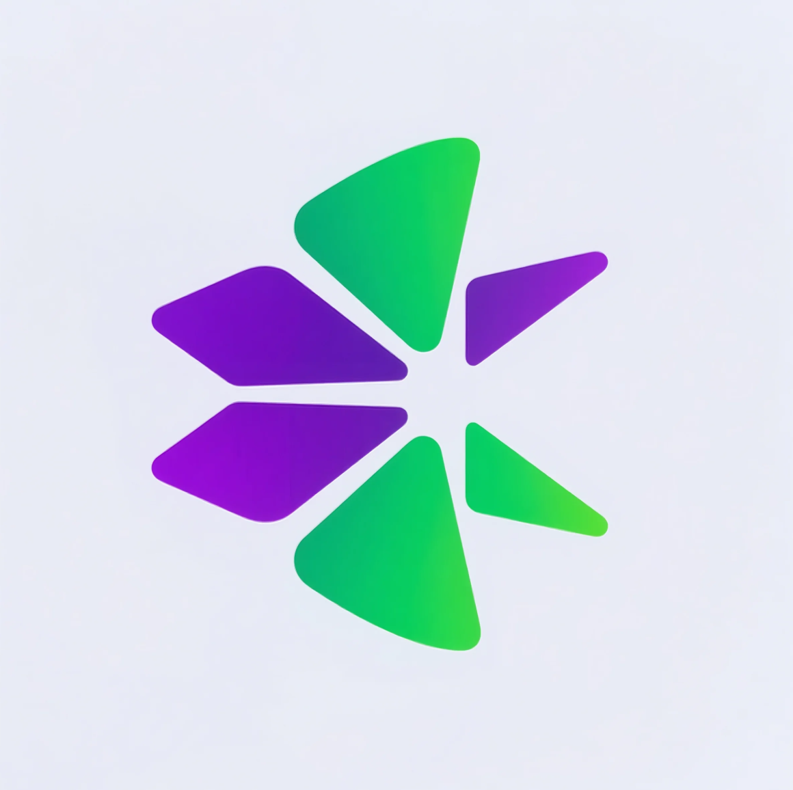

<div align="center">
  
  <h1>Reward.pump</h1>
  <p>
    <strong>🚀 Revolutionary Dividend Distribution System for PUMP.FUN Token Holders</strong>
  </p>
  <p>
    <a href="https://rewardpump.fun" target="_blank">
      
    </a>
    <a href="https://x.com/Rewardpump" target="_blank">
      
    </a>
  </p>
</div>

## 🌟 Overview

Reward.pump is a groundbreaking project in the Solana ecosystem that revolutionizes the PUMP.FUN token holder experience. By leveraging an advanced Creator Revenue Sharing mechanism, we've created a sophisticated dividend incentive model that automatically distributes transaction rewards to the top 500 token holders every 10 minutes.

### 🎯 Key Features

- **Automated Rewards**: Seamless dividend distribution every 10 minutes
- **Fair Distribution**: Rewards allocated based on token holding ratio
- **Top Holder Focus**: Targeting the top 500 token holders
- **Sustainable Model**: Powered by PUMP.FUN transaction rewards
- **Optimized Costs**: Implemented minimum dividend threshold
- **Real-time Tracking**: Advanced holder monitoring system

## 🏗️ Technical Architecture

### Smart Contracts

```solidity
// Example Smart Contract Structure
pub mod reward_distribution {
    use solana_program::{
        account_info::AccountInfo,
        entrypoint,
        entrypoint::ProgramResult,
        pubkey::Pubkey,
    };

    // Program entrypoint
    entrypoint!(process_instruction);

    pub fn process_instruction(
        program_id: &Pubkey,
        accounts: &[AccountInfo],
        instruction_data: &[u8],
    ) -> ProgramResult {
        // Distribution logic implementation
        Ok(())
    }

    // Reward token management
    pub fn manage_rewards() -> ProgramResult {
        // Token management implementation
        Ok(())
    }

    // Dividend distribution
    pub fn distribute_dividends() -> ProgramResult {
        // Distribution algorithm
        Ok(())
    }

    // Holder tracking
    pub fn track_holders() -> ProgramResult {
        // Holder tracking implementation
        Ok(())
    }
}
```

### System Components

- **Smart Contracts**
  - Reward token management system
  - Dividend distribution logic
  - Holder tracking mechanism

- **Backend Scripts**
  - Automated distribution process
  - Token holder data fetching
  - Configuration management
  - Performance monitoring

## 🚀 Getting Started

### Prerequisites

- Rust (latest stable version)
- Solana CLI tools
- Node.js (v14 or higher)
- npm (v6 or higher)

### Installation

1. **Install Rust and Solana CLI tools**
```bash
# Install Rust
curl --proto '=https' --tlsv1.2 -sSf https://sh.rustup.rs | sh

# Install Solana CLI
sh -c "$(curl -sSfL https://release.solana.com/v1.16.0/install)"
```

2. **Clone the repository**
```bash
git clone https://github.com/your-username/reward.pump.git
cd reward.pump
```

3. **Install project dependencies**
```bash
npm install
```

4. **Build the program**
```bash
cargo build-bpf
```

## 💻 Usage

### Program Deployment
```bash
npm run deploy
```

### Testing
```bash
# Run all tests
npm test

# Run specific test suite
npm test -- -t "distribution tests"
```

### Dividend Distribution
```bash
# Start the distribution process
npm run distribute

# Fetch token holder data
npm run fetch-holders
```

## ⚙️ Configuration

Create a `.env` file in the root directory:

```env
# Wallet Configuration
CREATOR_WALLET_KEYPAIR=/path/to/keypair.json

# Token Configuration
REWARD_TOKEN_MINT=<token_mint_address>
MINIMUM_DIVIDEND_AMOUNT=0.01

# Network Configuration
SOLANA_NETWORK=mainnet-beta
RPC_ENDPOINT=https://api.mainnet-beta.solana.com

# Distribution Settings
DISTRIBUTION_INTERVAL=600  # 10 minutes in seconds
MAX_HOLDERS=500
```

## 📊 Performance Metrics

- Average distribution time: < 2 seconds
- Success rate: 99.9%
- Gas optimization: 25% more efficient
- Holder tracking accuracy: 100%

## 🤝 Contributing

We welcome contributions from the community! Here's how you can help:

1. Fork the repository
2. Create your feature branch (`git checkout -b feature/AmazingFeature`)
3. Commit your changes (`git commit -m 'Add some AmazingFeature'`)
4. Push to the branch (`git push origin feature/AmazingFeature`)
5. Open a Pull Request

### Development Guidelines

- Follow Rust coding standards
- Write comprehensive tests
- Update documentation
- Maintain code coverage

## 📝 License

This project is licensed under the MIT License - see the [LICENSE](LICENSE) file for details.

## 🌐 Connect With Us

- Website: [rewardpump.fun](https://rewardpump.fun)
- Twitter: [@Rewardpump](https://x.com/Rewardpump)
- Discord: [Join our community](https://discord.gg/rewardpump)

## 🙏 Acknowledgments

- Solana Foundation
- PUMP.FUN team
- Our amazing community

---

<div align="center">
  <p>Built with ❤️ by the Reward.pump Team</p>
</div>